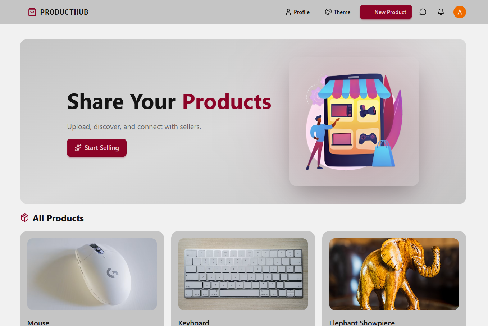
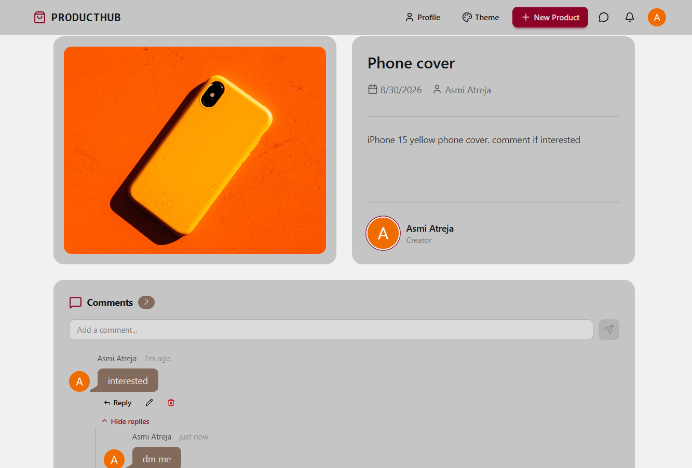
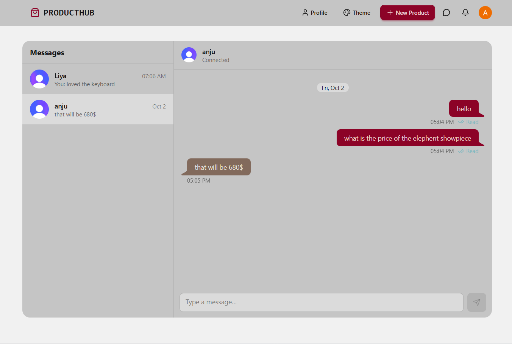
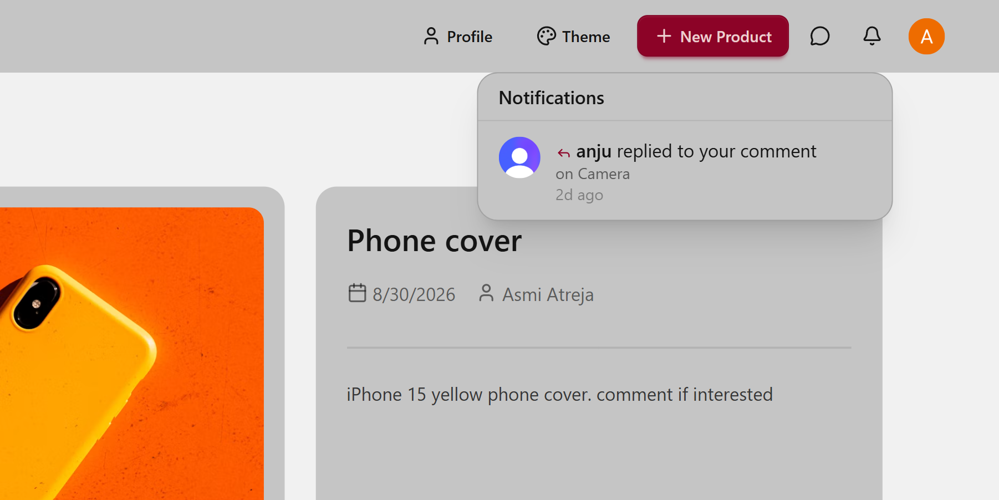
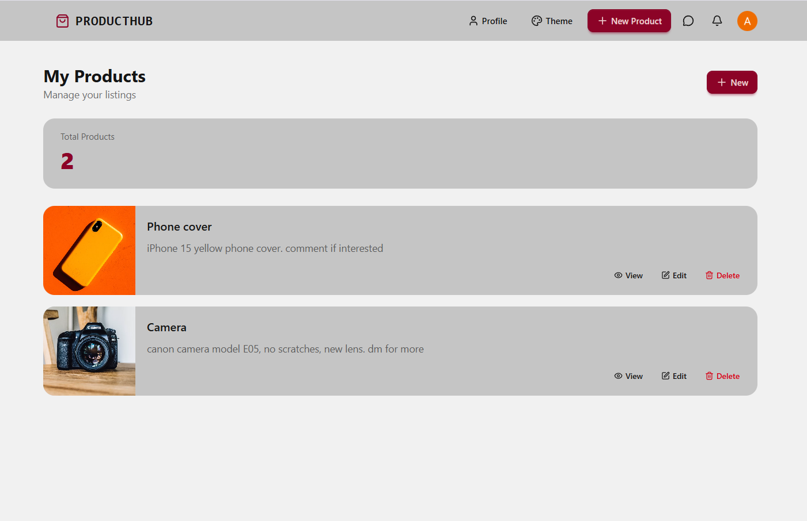
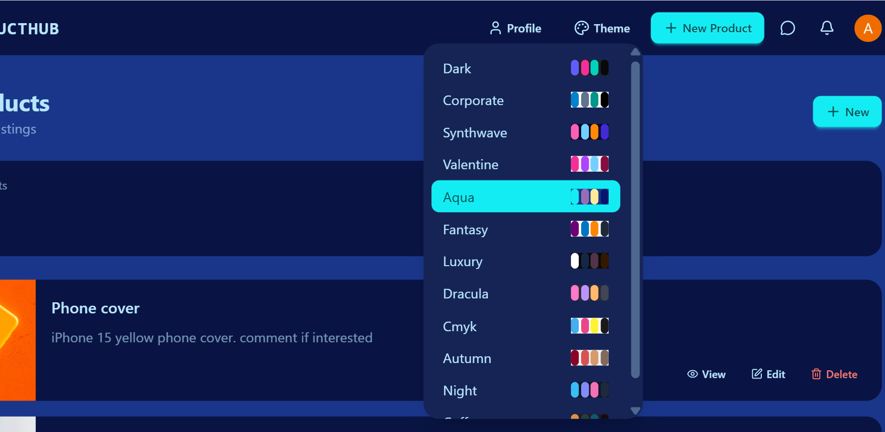

# 🛍️ ​ProductHub

ProductHub is a full-stack marketplace app where users can list products, comment on them with threaded replies, and **message sellers directly in real time**. It includes an unread message badge, reply notifications, and reliable message delivery that survives going offline. The whole UI is responsive, from mobile to desktop.

## 🛠️ ​Tech Stack

- **React 19 + Vite**: frontend UI and fast dev/build tooling
- **Tailwind CSS + DaisyUI**: responsive styling and 30+ themes
- **TanStack Query**: API data fetching, caching, pagination and infinite loading
- **React Router**: page routing (home, product, messages, profile)
- **Clerk**: authentication and user sessions, used for both REST and WebSocket connections
- **Node.js + Express 5 (TypeScript)**: REST API backend
- **ws (WebSockets)**: live chat, delivered/read status and real-time unread counts
- **PostgreSQL**: storage for products, comments, messages and notifications
- **Drizzle ORM**: type-safe queries and schema management
- **Lucide React**: UI icons

## 📷 Screenshots

### Home


### Product detail with comment section


### Inbox + real-time chat


### Notifications


### Profile


### Themes


## ⭐ Features

- **Products:** create, edit, delete, browse and a profile page for your listings.
- **Direct messages:** WebSocket delivery persisted in Postgres, with sent/delivered/read ticks, optimistic sending, unread badge in the navbar and auto-reconnect. Messages sent while offline are retried over HTTP and never duplicated.
- **Comments** with threaded replies, edit/delete (owner only) and reply counts.
- **Notifications:** a bell for comment replies (several replies to one thread fold into one notification) and a toast for new DMs.
- **Responsive UI** with 10+ DaisyUI themes.

## ​🚀 ​Getting started

Requires Node 20+, a PostgreSQL database, and a [Clerk](https://clerk.com) application.

**1. Environment variables**

`backend/.env`
```
PORT=3000
DATABASE_URL=postgresql://...
FRONTEND_URL=http://localhost:5173
CLERK_PUBLISHABLE_KEY=pk_...
CLERK_SECRET_KEY=sk_...
```

`frontend/.env`
```
VITE_CLERK_PUBLISHABLE_KEY=pk_...
VITE_API_URL=http://localhost:3000/api
```
The WebSocket URL is currently derived from `VITE_API_URL` (override with `VITE_WS_URL` if needed).

**2. Install, create tables, run**

```bash
cd backend  && npm install && npm run db:push && npm run dev
cd frontend && npm install && npm run dev
```

## 📋​ Testing messaging locally

Clerk sessions are shared between tabs of one browser, so use two separate sessions: a normal window (buyer) and an Incognito window (seller). The seller creates a product, the buyer opens it and clicks **Send Message**, and the seller sees the unread badge appear without refreshing.